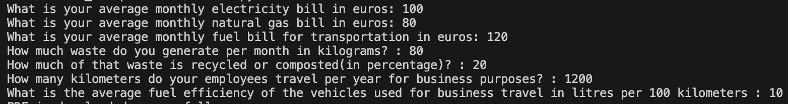
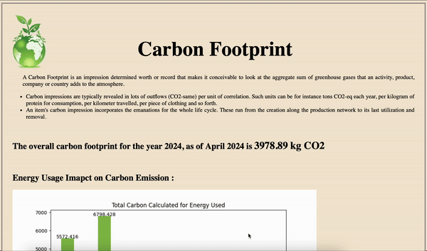

# Carbon Footprint Monitoring Tool 🍀

The Carbon Footprint Monitoring Tool is a Python script that calculates and generates reports on carbon emissions based on various activities such as energy usage, waste generation, and business travel.

## Features 🔑

* Calculate carbon emissions for different activities.
* Generate HTML reports with interactive graphs.
* Convert HTML reports to PDF format.

## Installation 💾
#### 1. Clone this repository to your local machine using HTTPS:
```bash
git clone https://github.com/SHA-15/M602-Carbon-Footprint-Monitoring-Tool.git
```
#### 2. Python version 
```bash
Python 3.12.0
```
#### 3. Install the required dependencies for the cloned project 
```bash
pip install -r requirements.txt
```

## How to run the application ⌨️
 ####  1. Run the main.py script:
 ```bash💾💾
 python3 main.py
 ```
 
 ####  2. Follow the promts to input different activities. 
  > ( Note: For precentage value input you can give a number without %. Ex: Instead of 40% or 0.4, you should give 40.)

 #### 3. The script will generate an HTML report and open it in your default browser. You can also find the doowbloaded report of the webpage in your project directory.

## Input values 🔢
Here is a sample of how you can input the values.



## Output 💻



 ## Dependencies used in the project 💉
  * 📊 *Matplotlib* - A comprehensive library used to create vizualizations. i.e, generating plots and graphs.

  * 📑 *pdfkit* - A python library used for converting HTML webpages to PDF.

  * ⏰ *datetime* - The datetime module supplies classes for manipulating dates and times.


